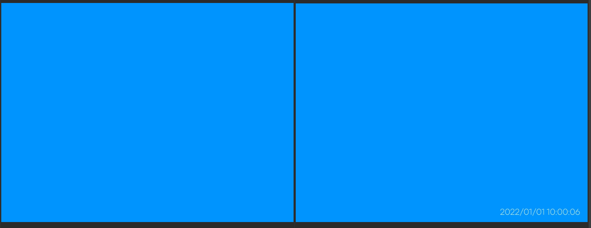

# Adds a random DateTime to the jpeg photos starting from arbitrary date



In each subsequent photo, the date will be larger by rand(minSec, maxSec) than the date in the previous photo

## How to use

1. git clone git@github.com:xpohoc69/photodate.git
2. go install github.com/xpohoc69/photodate
3. add jpg photos to source directory
4. run from project directory command `photodate -sdt="2022-01-01 10:00:00" -min-sec=5 -max-sec=10`
5. photos with date will be available in target directory with .zip archive

```
Options:
    -max-sec int
        Max seconds to add (default 10)
    -min-sec int
        Min seconds to add (default 5)
    -sdt string
        Start date time photo (Y-m-d H:i:s)
```
